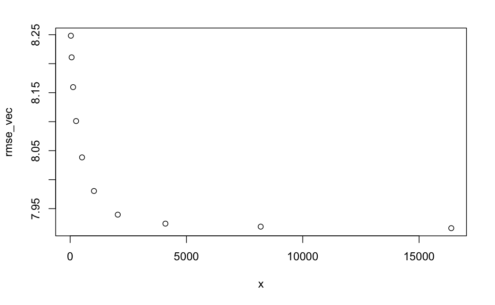

```{r setup, include=FALSE}
knitr::opts_chunk$set(echo = TRUE)
```

```{r,echo=FALSE}
echo_flag <- FALSE
```

# Code


## Loading Libraries
```{r}
library(tidyverse)
```

```{r my_chunk, fig.cap = ""}
attach(mtcars)
plot(wt, mpg)
```

## Loading the data
```{r}
library(nycflights13)
library(Hmisc)
set.seed(42)
original_data <- read_csv("fltrain.csv.gz")
DF <- original_data
```

# turning all columns with datatype characters to factors. 
```{r}
DF[sapply(DF, is.character)] <- lapply(DF[sapply(DF, is.character)], 
                                       as.factor)
DF$flight <- as.factor(DF$flight)
str(DF)
```


```{r}
library(lubridate)
DF$sched_arr_time_posix <- as.POSIXct(str_pad(as.character(DF$sched_arr_time), 4, pad="0"),format="%H%M")
DF$sched_arr_time_hour <- hour(DF$sched_arr_time_posix)
DF$sched_arr_time_minute <- minute(DF$sched_arr_time_posix)

#num minute is number of minutes since start of day for scheduled arrival time
DF$sched_arr_time_num_minute <- 60*DF$sched_arr_time_hour + DF$sched_arr_time_minute

DF$sched_dep_time_posix <- as.POSIXct(str_pad(as.character(DF$sched_dep_time),4 , pad="0"),format="%H%M")
DF$sched_dep_time_hour <- hour(DF$sched_dep_time_posix)
DF$sched_dep_time_minute <- minute(DF$sched_dep_time_posix)
#num minute is number of minutes since start of day for scheduled depival time
DF$sched_dep_time_num_minute <- 60*DF$sched_dep_time_hour + DF$sched_dep_time_minute
```
```{r}
select(original_data, time_hour, sched_dep_time, sched_arr_time, tz, tzone)
select(DF, sched_arr_time, sched_arr_time_hour)
```

```{r}
DF$sched_air_time <- DF$sched_arr_time_posix - DF$sched_dep_time_posix
drops <- c('sched_arr_time_posix', 'sched_arr_time_hour', 'sched_dep_time_posix', 'sched_dep_time_hour', 'sched_dep_time', 'sched_arr_time', 'hour', 'time', 'minute', 'time_hour' )
DF <- DF[ , !(names(DF) %in% drops)]
```


```{r}
drops <- c("dep_time", "arr_time", "air_time", "arr_delay", "year.x", 'tailnum')
DF <- DF[ , !(names(DF) %in% drops)]
```


```{r}
DF
```


```{r}
## Remove columns with more than 50% NA
DF <- DF[, -which(colMeans(is.na(DF)) > 0.5)]
```

```{r}
DF$sched_air_time <- as.numeric(DF$sched_air_time)
library(imputeMissings)
impute_model <- imputeMissings::compute(DF, method="median/mode")
impute_model
DF <- impute(DF, object=impute_model, flag=TRUE)
DF <- DF[!duplicated(as.list(DF))]  #remove all redundant flag columns that are identical to each other. 
```

```{r}
numeric_only_df <- dplyr::select_if(DF, is.numeric)
library(corrplot)
```


```{r corrplot, fig.cap = "My caption", echo=echo_flag}
corrplot(cor(numeric_only_df), type = 'lower')
```

# try features scaling
```{r}
dep_delay_vec <- DF$dep_delay
DF$dep_delay <- NULL
head(DF)

library(dplyr)
DF <- DF %>% mutate_if(is.numeric, scale)
head(DF)
DF$dep_delay <- dep_delay_vec
```

# Exploratory Data Analysis

```{r}

numeric_DF <- dplyr::select_if(DF, is.numeric) %>%  scale()

```

```{r}
prcomp_res <- prcomp(numeric_DF)
sdev <- prcomp_res$sdev
sdev
```

### all four components at same time
```{r}
colSums(prcomp_res$x^2)/sum(numeric_DF^2)
```

```{r}
rotation <- as.data.frame(prcomp_res$rotation)
rotation[order(-abs(rotation$PC1)),]
```
```{r}
head(rotation[order(-abs(rotation$PC2)),])
```


#take out extreme departure delays
```{r}
DF<-DF[DF$dep_delay < 30,]
```

```{r}
set.seed(42)
DF$flight <- NULL
train_index <- sample(1:nrow(DF),size=2*nrow(DF)/3,replace=FALSE)
train_df <- DF[train_index,]
test_df <- DF[-train_index,]
```


# predicting 0
```{r}
rmse = mean((test_df$dep_delay-0)^2) %>% sqrt()
rmse
```

# predicting the mean
```{r}
rmse = mean((test_df$dep_delay-mean(train_df$dep_delay))^2)%>% sqrt()
rmse
```


# predicting the median
```{r}
rmse = mean((test_df$dep_delay-median(train_df$dep_delay))^2)%>% sqrt()
rmse
```


# linear regression with dep
```{r}
model <- lm(dep_delay ~ ., data=train_df)
model_without_dep <-  lm(dep_delay ~ .-dest, data=train_df)
anova(model, model_without_dep)
summary <- round(summary(model)$coefficients,6)
sorteddf <- summary[order(summary[,ncol(summary)]),]
head(sorteddf)
```


```{r}
head(sorteddf)
```

```{r}
lm_test_df <- test_df

in_test_but_not_train <- setdiff(unique(lm_test_df$model), unique(train_df$model))
lm_test_df <- lm_test_df[ !lm_test_df$model %in% in_test_but_not_train, ]

in_test_but_not_train <- setdiff(unique(lm_test_df$dest), unique(train_df$dest))
lm_test_df <- lm_test_df[ !lm_test_df$dest %in% in_test_but_not_train, ]

preds = predict(model, newdata=lm_test_df)
rmse = sqrt(mean((lm_test_df$dep_delay - preds)^2))
rmse
```

# gbm
```{r}
train_gbm <- function(){
set.seed(42)
model <- gbm(dep_delay ~ ., data=train_df,
              n.trees=100, shrinkage=0.1) # default shrinkage = 0.1
preds = predict(model, newdata=test_df, n.trees=100)
rmse = sqrt(mean((test_df$dep_delay - preds)^2))
rmse
summary(model)
saveRDS(model, "model.rds")
my_model <- readRDS("model.rds")
}

destfile <- "model.rds"
library(gbm)
if(!file.exists(destfile)){
    res <- tryCatch(train_gbm,
                error=function(e) 1)
    print('could not load model properly')
}
```

fahrenheit_to_celsius <- function(temp_F) {
  temp_C <- (temp_F - 32) * 5 / 9
  return(temp_C)
}

Here, you can see the relative influence for each variable for gbm.  
For a gbm, the improvement in the splitting criterion (which is mean squared error for regression) for a given variable is calculated at each step.
The relative influence for a given variable is the average of these improvements over all the trees where the aforementioned variable is used.


```{r}
model <- gbm(dep_delay ~ ., data=train_df,
              n.trees=1000, shrinkage=0.01) # default shrinkage = 0.1
preds = predict(model, newdata=test_df, n.trees=1000)
rmse = sqrt(mean((test_df$dep_delay - preds)^2))
rmse
summary(model)
```

```{r}
rmse = sqrt(mean((test_df$dep_delay - preds)^2))
rmse
```

```{r}
set.seed(42)

x <- 2^seq(5,14, by=1)
rmse_vec <- numeric(length(x))
count <- 1
for (val in x) {
  hboost <- gbm(
    dep_delay ~ .,
    data = train_df,
    n.trees = val,
    distribution = 'gaussian',
    shrinkage = 0.001
  )
  preds = predict(hboost, n.trees = val, newdata = test_df)
  mse = mean((test_df$dep_delay - preds) ^ 2)
  rmse <- sqrt(mse)
  rmse_vec[count] <- rmse
 
  print(val)
  print(rmse)
  count = count + 1
}

plot(x, rmse_vec)


summary(hboost)
class(summary(hboost))
summary <- summary(hboost)
write.csv(summary,'0point001_16384trees_gbm.csv')
```


```{r}
rmse = sqrt(mean((test_df$dep_delay - preds)^2))
rmse
```
```{r}
summary(hboost)
```
```{r}
#gbm_benchmark2 <- data.frame("num_trees"=x, "rmse"=rmse_vec)
gbm_benchmark2 <- read_csv('shrinkage_0point001_numtrees_32_to_16384_gbm_benchmark_v2.csv')
```

```{r}
gbm_benchmark<-read_csv('shrinkage_0point01_numtrees_32_to_16384_gbm_benchmark.csv')
gbm_benchmark
```

Above values are for gbm with shrinkage of 0.01
Analysis:

Tuning gbm


Here I plotted root mean squared error (rmse) vs the number of trees for shrinkage of 0.01 and all other variables as default for gbm. 
You can see that after around 5000 trees, increasing the number of trees further gives diminishing returns.

```{r}
library(EZtune)
response <- DF$dep_delay
eztune_df <- DF
eztune_df$dep_delay <- NULL
eztune_obj <- eztune(eztune_df, response, method = "gbm", optimizer = "hjn", fast = TRUE,
cross = NULL)
eztune_obj
```


> eztune_obj
$n
[1] 200

$n.trees
[1] 2001

$interaction.depth
[1] 10

$n.minobsinnode
[1] 7

$shrinkage
[1] 0.001

$mse
[1] 72.68835

$model
gbm::gbm(formula = y ~ ., distribution = "gaussian", data = dat, 
    n.trees = results$n.trees, interaction.depth = results$interaction.depth, 
    n.minobsinnode = results$n.minobsinnode, shrinkage = results$shrinkage)
A gradient boosted model with gaussian loss function.
2001 iterations were performed.
There were 42 predictors of which 24 had non-zero influence.

> sqrt(72)
[1] 8.485281
> sqrt(72.68)
[1] 8.525257
> 


# References


